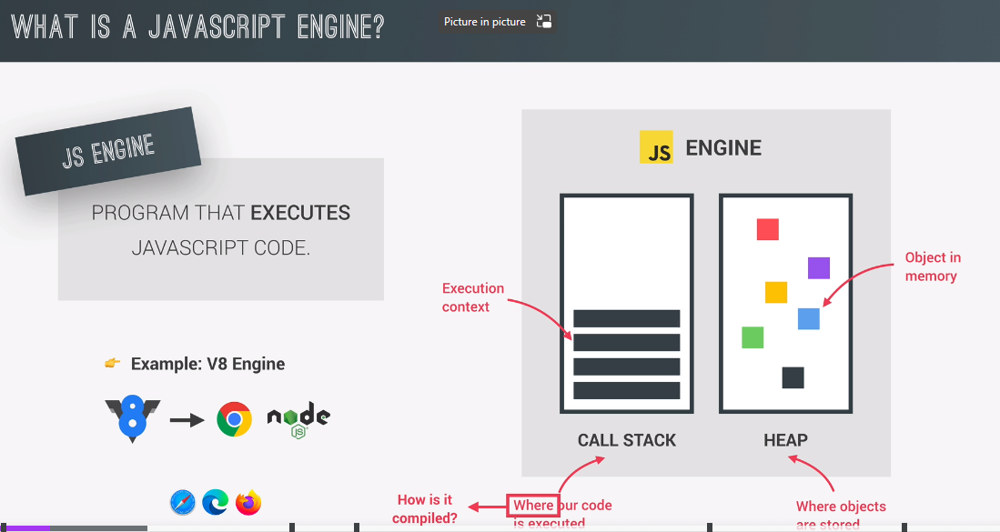
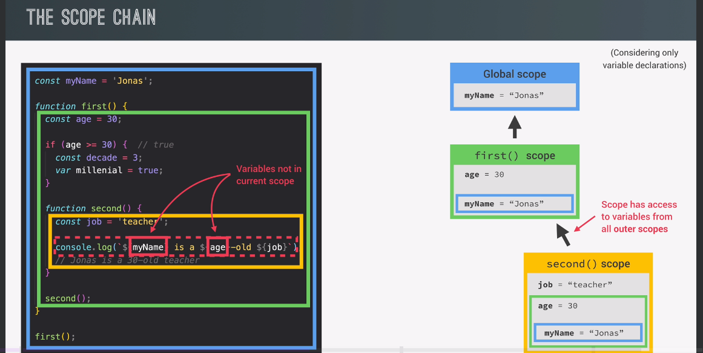

## 1️⃣ **High-level Overview of JavaScript**

Javascript Is a High-Level, Object-Oriented, Multi-Paradigm Programming Language.

Javascript Is a High-Level Prototype-Based Object-Oriented Multi-Paradigm Interpreted or Just-in-Time Compiled Dynamic| Single-Threaded Garbage-Collected Programming Language With First-Class Functions and a Non-Blocking Event Loop Concurrency Model

### High Level


### Garbage-collected


### Interpreted or just-in-time


### Multi-paradigm


### Prototype-based object-oriented


### First-class functions


### Dynamic


### Single-threaded

### Non-blocking event loop


<br>

## 2️⃣ **The JS Engine and Runtine**



- So a JavaScript engine is simply a computer program that executes JavaScript code.
- Now every browser has its own JavaScript engine but probably the most well known engine is Google's V-Eight.
- So any JavaScript engine always contains a call stack and a heap. The call stack is where our code is actually executed using something called execution contexts. Then the heap is an unstructured memory pool which stores all the objects that our application needs.

### Compilation vs Interpretation


### Just in Time COmpilation


### Runtime in Browser


### Runtime in NodeJs


<br>

## ** 3️⃣ **Execution Contexts and the Call Stack\*\*


But now what exactly is an execution context? Well, an execution context is an abstract concept. But I define it basically as an environment in which a piece of JavaScript is executed. a It's like a box that stores all the necessary information for some code to be executed. Such as local variables or arguments passed into a function. So, JavaScript code always runs inside an execution context.

Now, in any JavaScript project, no matter how large it is, there is only ever one global execution context. It's always there as the default context, and it's where top-level code will execute.

### 4️⃣ **Execution Context in Detail**


Because remember each function gets its own execution context as soon as the function is called. So basically all the variables that are somehow declared inside a function, will end up in its variable environment. However, a function can also access variables outside of the function and this works because of something called the scope chain.

Scope chain basically consists of references to variables that are located outside of the current function. And to keep track of the scope chain, it is stored in each execution context.

Execution contexts belonging to arrow functions, do not get their own arguments keyword, nor do they get the this keyword, okay? So, basically arrow functions don't have the arguments object and the this keyword. Instead, they can use the arguments object, and the this keyword from their closest regular function parent.

### 5️⃣ **The Call Stack**


JavaScript has only one thread of execution. And so it can only do one thing at a time.

So like to use the analogy of the call stack being like a map for the JavaScript engine. Because the call stack ensures that the order of execution never gets lost.

<br>

### 6️⃣ **Scope and the Scope Chain**

### Scope Concepts

- **Scoping**: How our program's variables are organized and accessed. "Where do variables live?" or "Where can we access a certain variable, and where not?",
- **Lexical scoping**: Scoping is controlled by placement of functions and blocks in the code. Example: A function inside another function can access the variables of the parent function.

- **Scope**: Space or environment in which a certain variable is declared (variable environment in case of functions). There is global scope, function scope, and block scope;
- **Scope of a variable**: Region of our code where a certain variable can be accessed.


### Scope Chain vs. The Call Stack




#### SUMMARY

> Scoping asks "Where do variables live" or "Where can we access a certain variable, and where not?";

> 3 types of scope in JS": (1) Global scope (2) Scopes defined by functions, and (3) Scopes defined by blocks.

> Only **let** and **const** variables are block-scoped. Variables declared with **var** end up in the closest function scope;

> In JS, we have **lexical scoping**, so reules of where we can access variables are based on exactly where in the code functions and blocks are written.

> Every scope always has access to all variables from all its outer scopes. This is the scope chain.

> When a variable is not in the current scope, the engine **looks up** in the scope chain until it fins the varible it is looking for. This is called **variable lookup**.

> The scope chain is a one-way street: a scope will never ever have access to the variables of the inner scope.

> The scope chain in a certain scope is equal to adding together all the variable environment of all the parent scopes.

// To be added

### 7️⃣ **Scoping in Practice**

```js
"use strict";

function calcAge(birthYear) {
  const age = 2037 - birthYear;

  function printAge() {
    let output = `${firstName}, You are ${age}, born in ${birthYear}.`;
    console.log(output); // Ethan, You are 46, born in 1991.

    if (birthYear >= 1981 && birthYear <= 1996) {
      // redeclare firstName and is used in the string statement since it is within the current scope and earlier than the global variable declared outside.
      // 'John' and 'Ethan' have the same variable name but 2 diff variables which have their own scope. If you want to reasssign, use let instead
      // Creating new variable with the same name as outer scope's variable
      const firstName = "John";
      const str = `Oh, and you're a millenial, ${firstName}`;
      console.log(str); // Oh, and you're a millenial, John

      // functions in ES6 are alo block scoped. Can access only inside the block it was declared with
      function add(a, b) {
        console.log(a + b); // 5
        return a + b;
      }

      // reassign outer scope's variable
      output = "NEW OUTPUT";
      // console.log(output);

      add(2, 3);
    }

    console.log(output);
  }
  printAge();

  return age;
}

const firstName = "Ethan";
calcAge(1991);

// REMEMBER: Variable Lookup Concept
// console.log(age); // Ref error
// printAge(); // Ref error

//OUTPUT
/*
Ethan, You are 46, born in 1991.
Oh, and you're a millenial, John
5
NEW OUTPUT
*/
```

- const and let variables are block scoped.
- so variables declared with the var keyword are function scoped. So they simply ignore the block, because they are not block scoped at all. They're just function scoped.
- the scope of a variable is the entire region of the code in which the variable is accessible.
- Functions are block scoped in Strict Mode
- So the scope chain isn't necessary at all, if the variable that we're looking for is already in the current scope.

<br>

## 8️⃣ **Variable Environment: Hoisting and the TDZ**


In JavaScript, hoisting is a mechanism that allows variables and function declarations to be moved to the top of their containing scope during the compilation phase. This means that they are "lifted" to the top of their respective scope before the code is executed. This behavior occurs during the creation phase of the execution context, which was mentioned earlier.

However, it's important to note that hoisting behaves differently for variables declared with **var**, **let**, **const**, function declarations, and function expressions:

1. Variables declared with **var**:

- Variables declared with **var** are hoisted to the top of their containing function or global scope. They are initialized with **undefined**.
- This is why you can access and use **var** variables before they are declared in the code. They have an initial value of **undefined**.

2. Variables declared with **let** and **const**:

- Variables declared with **let** and **const** are also hoisted to the top of their containing block (usually a function or a statement block). However, they are not initialized. Instead, they enter the "Temporal Dead Zone" (TDZ), where accessing them before declaration results in a **ReferenceError**.
- You can only access **let** and **const** variables after they have been declared in the code.

3. Function Declarations:

- Function declarations are fully hoisted. They are moved to the top of their containing scope and can be used before their actual declaration in the code.

4. Function Expressions:

- Function expressions created with var are hoisted to undefined, similar to var variables.
- Function expressions created with let or const are also hoisted but remain in the TDZ, and you can't access them before declaration.


In summary, the Temporal Dead Zone was introduced to improve error detection, enforce best practices, and ensure that const variables maintain their immutability. It also preserves historical behavior related to function declarations and mutual recursion. Understanding the TDZ is essential for writing clean and error-free JavaScript code.

1. **Temporal Dead Zone (TDZ)**: The TDZ is a designated period in the execution context where accessing a **let** or **const** variable before it's declared results in a runtime error. It starts at the beginning of the scope and continues until the line where the variable is actually declared. The TDZ exists to catch and prevent errors caused by accessing variables that are not yet defined.

2. **Error Prevention**: The primary reason for introducing the TDZ in ES6 was to make it easier to catch and prevent errors. Attempting to use a variable before its declaration could lead to subtle bugs that are difficult to trace. By introducing the TDZ, JavaScript ensures that such usage results in an error, making the code more robust.

3. **Best Practices**: Accessing variables before declaration is considered bad practice and should be avoided. By enforcing errors in such cases, the TDZ encourages developers to write more reliable code.

4. **const Variables**: The TDZ also serves the purpose of making **const** variables work as intended. Since **const** variables cannot be reassigned, there is no way to set them to **undefined** first and then assign their real value. This ensures the **immutability** of const variables.

5. **Historical Reasons**: Hoisting, including the hoisting of var variables, was initially implemented to allow function declarations to be used before their actual declarations in the code. This was crucial for some programming techniques, like mutual recursion. It was seen as a way to make code more readable. As a result, the hoisting of var variables is essentially a byproduct of hoisting functions.

<br>

## 9️⃣ **Hoisting and TDZ in Practice**

```js
// VARIABLES
console.log(me); // undefined
// console.log(job); // ref error
// console.log(year); // ref error

var me = "Etan";
let job = "teacher";
const year = 1991;
```

```js
/ FUNCTIONS
console.log(addDecl(2, 3)); // 5
// console.log(addExpr(2, 3)); // ref error
// console.log(addArrow(2, 3)); // ref

function addDecl(a, b) {
  return a + b;
}

const addExpr = function (a, b) {
  return a + b;
};

const addArrow = (a, b) => {
  a + b;
};

```

```js
// MOre example
if (!numProducts) {
  deleteShoppingCart();
}

var numProducts = 10;
function deleteShoppingCart() {
  console.log("All products deleted!"); // All products deleted!
}

// NOTE: Don't use VAR as a general rule
// It is BEST to declare your variables at the top of each scope
// Always declare all functions first and use them only after the declaration

// Another example

// variables declared with let or const do not create properties in the window object
var x = 1;
let y = 2;
const z = 3;
```

<br>

## 🔟 **The this keyword**


Understanding the behavior of **this** in arrow functions is crucial for working with JavaScript, as it can help you avoid common pitfalls and write code that behaves as expected in different contexts. Arrow functions are particularly useful in cases where you want to retain the context of the parent function, making them a valuable tool in modern JavaScript development.

1. this in Arrow Functions: When you use this inside an arrow function, it behaves differently from regular functions. In arrow functions, this is determined by the surrounding (lexical) scope, specifically the parent function or context where the arrow function is defined. This behavior is often referred to as the "lexical this keyword."

2. **What this Is Not**: It's essential to understand what
   is not:

- a. this is In other words, this doesn't refer to the function in which it's used. Instead, it captures the context from the surrounding scope, typically the parent function.

- b. this is not the variable environment: The this keyword doesn't point to the variable environment of the function. It's a separate context mechanism that provides a reference to the object that calls or owns the function.

<br>

## 1️⃣1️⃣ **'this' keyword in Practice**

```js
console.log(this); // {}

const calcAge = function (birthYear) {
  console.log(2037 - birthYear); // 46
  console.log(this); // undefined (Simple function call)
};

calcAge(1991);

const calcAgeArrow = (birthYear) => {
  console.log(2037 - birthYear); // 46
  console.log(this); // {}  'this' refers to the global object (window in a browser)
};

calcAgeArrow(1991);

/*
It's important to note that arrow functions are not suitable for methods that rely on their own this context, as they will inherit the this from their lexical parent, which might not be what you expect. Arrow functions are often used for simple, self-contained functions or for functions that need to capture the this context from their surrounding scope, making them useful in certain scenarios.
*/
```

### **Method Object**

```js
const ethanProfile = {
  year: 1991,
  calcAge: function () {
    console.log(this); //{ year: 1991, calcAge: [Function: calcAge] }
    console.log(2037 - this.year); // 46
  },
};

ethanProfile.calcAge();
```

```js
// Other example

const mathilda = {
  year: 2017,
};

mathilda.calcAge = ethanProfile.calcAge;
// this keyword -> always points to the object calling the method
mathilda.calcAge();

/*
{ year: 2017, calcAge: [Function: calcAge] }    
20
*/

// Other example
const f = ethanProfile.calcAge;
f(); // type Error
```

<br>

## 1️⃣2️⃣ **Regular vs Arrow Function**

```js
// var firstName = 'Mathilda'; (Do not use this)

const ethanProfile = {
  // all this is an object literal
  firstName: "Ethan",
  year: 1991,
  calcAge: function () {
    console.log(this);
    console.log(2037 - this.year);

    // USE ARROW FUNCTION inside surrounding function

    const isMillenial = () => {
      console.log(this.year >= 1981 && this.year <= 1996); // true
    };

    isMillenial();
  },
  // USE REGULAR FUNCTION as key unlike using arrow function whcih doesnt have 'this' context as it inherit from the glocal scope (window object)
  greet: function () {
    // agaim , from previous lesson, 'this' keyword with arrow function will use the glocal scope(window object) which is undefined, but if it has parent functions, it will use lexical
    console.log(this);
    console.log(`Hey ${this.firstName}`); // Hey undefined
  },
};

ethanProfile.greet(); // Hey undefined
ethanProfile.calcAge(); // TypeError
console.log(this.firstName); // undefined

// USE REGULAR FUNCTION as a method instead of an arrow function
```

<br>

## 1️⃣3️⃣ **Primitives vs Objects (Primitive vs Reference TYpe)**


```js
let age = 30;
let oldAge = age;
age = 31;

console.log(age); // 31
console.log(oldAge); // 30

const me = {
  name: "Ethan",
  age: 30,
};

const friend = me;
friend.age = 24;

//
console.log(me); // { name: 'Ethan', age: 24 }
console.log(friend); // { name: 'Ethan', age: 24 }
```


<br>

## 1️⃣4️⃣ **Primitives vs. Objects in Practice**

```js
let lastName = "Williams";
let oldLastName = lastName;
lastName = "Davis";

console.log(lastName, oldLastName); // Davis Williams

const jessica = {
  firstName: "Jessica",
  lastName: "Williams",
  age: 27,
};

const marriedJessica = jessica;
marriedJessica.lastName = "Davis";
console.log("Before marriage:", jessica); // Before marriage: { firstName: 'Jessica', lastName: 'Davis', age: 27 }
console.log("After marriage: ", marriedJessica); // After marriage:  { firstName: 'Jessica', lastName: 'Davis', age: 27 }
```

#### Merging + Copying Objects

```js
const jessica2 = {
  firstName: "Jessica",
  lastName: "Williams",
  age: 27,
  family: ["Alice", "Bob"],
};

const jessicaCopy = Object.assign({}, jessica2);
jessicaCopy.lastName = "Davis";
jessicaCopy.family.push("Nary");
console.log("Before marriage:", jessica2); // Before marriage: { firstName: 'Jessica', lastName: 'Williams', age: 27,  family: [ 'Alice', 'Bob', 'Nary' ]  }
console.log("After marriage:", jessicaCopy); // After marriage: { firstName: 'Jessica', lastName: 'Davis', age: 27,  family: [ 'Alice', 'Bob', 'Nary' ]  }
```

<br>
