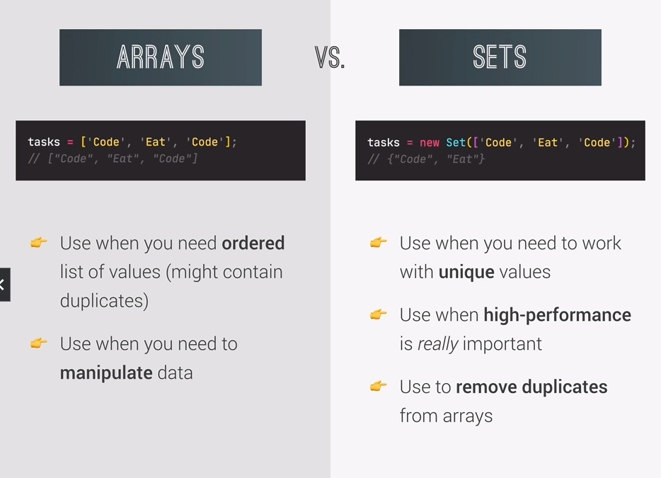

## 1️⃣ **Destructuring Arrays**

```js
"use strict";

// Data needed for a later exercise
const flights =
  "_Delayed_Departure;fao93766109;txl2133758440;11:25+_Arrival;bru0943384722;fao93766109;11:45+_Delayed_Arrival;hel7439299980;fao93766109;12:05+_Departure;fao93766109;lis2323639855;12:30";

// Data needed for first part of the section
const restaurant = {
  name: "Classico Italiano",
  location: "Via Angelo Tavanti 23, Firenze, Italy",
  categories: ["Italian", "Pizzeria", "Vegetarian", "Organic"],
  starterMenu: ["Focaccia", "Bruschetta", "Garlic Bread", "Caprese Salad"],
  mainMenu: ["Pizza", "Pasta", "Risotto"],

  order: function (starterIndex, mainIndex) {
    return [this.starterMenu[starterIndex], this.mainMenu[mainIndex]];
  },

  openingHours: {
    thu: {
      open: 12,
      close: 22,
    },
    fri: {
      open: 11,
      close: 23,
    },
    sat: {
      open: 0, // Open 24 hours
      close: 24,
    },
  },
};

const arr = [2, 3, 4];

// destructuring assignment
const [x, y, z] = arr;
console.log(x, y, z); // 2 3 4
console.log(arr); // [ 2, 3, 4 ]

// second example
let [main, , secondary] = restaurant.categories;
console.log(main, secondary); // Italian Vegetarian

// switching
[main, secondary] = [secondary, main];
console.log(main, secondary); // Vegetarian Italian

//function - return detructured array (multiple values)
const hello = restaurant.order(2, 0);
console.log(hello); // [ 'Garlic Bread', 'Pizza' ]
// receive 2 return values from a function
const [starterMenu, mainMenu] = hello;
console.log(mainMenu); // Pizza
console.log(starterMenu); // Garlic Bread
```

#### Nested array

```js
const nested = [2, 4, [5, 6]];
// const [i, , j] = nested;
// console.log(i, j); // 2 [ 5, 6 ]
const [i, , [j, k]] = nested;
console.log(i, j, k); // 2 5 6
```

#### Default values (fallback)

```js
const [p = 1, q = 1, r = 1] = [8, 9];
console.log(p, q, r); // 8 9 1
```

<br>

## 2️⃣ **Destructuring Objects**

```js
"use strict";

// Data needed for a later exercise
const flights =
  "_Delayed_Departure;fao93766109;txl2133758440;11:25+_Arrival;bru0943384722;fao93766109;11:45+_Delayed_Arrival;hel7439299980;fao93766109;12:05+_Departure;fao93766109;lis2323639855;12:30";

// Data needed for first part of the section
const restaurant = {
  name: "Classico Italiano",
  location: "Via Angelo Tavanti 23, Firenze, Italy",
  categories: ["Italian", "Pizzeria", "Vegetarian", "Organic"],
  starterMenu: ["Focaccia", "Bruschetta", "Garlic Bread", "Caprese Salad"],
  mainMenu: ["Pizza", "Pasta", "Risotto"],

  openingHours: {
    thu: {
      open: 12,
      close: 22,
    },
    fri: {
      open: 11,
      close: 23,
    },
    sat: {
      open: 0, // Open 24 hours
      close: 24,
    },
  },

  order: function (starterIndex, mainIndex) {
    return [this.starterMenu[starterIndex], this.mainMenu[mainIndex]];
  },

  orderDelivery: function ({
    starterIndex = 1,
    mainIndex = 0,
    time = "20:00",
    address,
  }) {
    console.log(
      `order received: ${this.starterMenu[starterIndex]} and ${this.mainMenu[mainIndex]} will be delivered to ${address} at ${time} `
    ); // order received: Garlic Bread and Risotto will be delivered to Dia ka, 21 at 22: 30
  },
};

restaurant.orderDelivery({
  time: "22: 30",
  address: "Dia ka, 21",
  mainIndex: 2,
  starterIndex: 2,
});

restaurant.orderDelivery({
  address: "0004 Feria Street",
  starterIndex: 1,
}); // order received: Bruschetta and Pizza will be delivered to 0004 Feria Street at 20:00

// DESCTRUCTURING OBJECTS
const { name, openingHours, categories } = restaurant;
console.log(name, openingHours, categories);
/*
Classico Italiano {
  thu: { open: 12, close: 22 },
  fri: { open: 11, close: 23 },
  sat: { open: 0, close: 24 }
} [ 'Italian', 'Pizzeria', 'Vegetarian', 'Organic' ]
*/

const {
  name: restaurantName,
  openingHours: hours,
  categories: tags,
} = restaurant;

console.log(restaurantName, hours, tags);
/*
Classico Italiano {
  thu: { open: 12, close: 22 },
  fri: { open: 11, close: 23 },
  sat: { open: 0, close: 24 }
} [ 'Italian', 'Pizzeria', 'Vegetarian', 'Organic' ]
*/

// Default values
const { menu = [], starterMenu: starters = [] } = restaurant;
console.log(menu, starters); // [] [ 'Focaccia', 'Bruschetta', 'Garlic Bread', 'Caprese Salad' ]

// Mutating variables
let a = 111;
let b = 999;
const obj = { a: 23, b: 7, c: 14 };

({ a, b } = obj);
console.log(a, b); // 3 7

// nested  objects
const {
  fri: { open: o, close: c },
} = openingHours;
console.log(o, c);
```

<br>

## 3️⃣ **Spread Operator**

> Spread operator can work in any iterable.

```js
const restaurant = {
  name: "Classico Italiano",
  location: "Via Angelo Tavanti 23, Firenze, Italy",
  categories: ["Italian", "Pizzeria", "Vegetarian", "Organic"],
  starterMenu: ["Focaccia", "Bruschetta", "Garlic Bread", "Caprese Salad"],
  mainMenu: ["Pizza", "Pasta", "Risotto"],

  openingHours: {
    thu: {
      open: 12,
      close: 22,
    },
    fri: {
      open: 11,
      close: 23,
    },
    sat: {
      open: 0,
      close: 24,
    },
  },

  order: function (starterIndex, mainIndex) {
    return [this.starterMenu[starterIndex], this.mainMenu[mainIndex]];
  },

  orderDelivery: function ({
    starterIndex = 1,
    mainIndex = 0,
    time = "20:00",
    address,
  }) {
    console.log(
      `order received: ${this.starterMenu[starterIndex]} and ${this.mainMenu[mainIndex]} will be delivered to ${address} at ${time} `
    );
  },

  orderPasta: function (ing1, ing2, ing3) {
    console.log(`Here is your pasta with ${ing1}, ${ing2} and ${ing3}`);
  },
};

// ARRAY Spread Operator

const arr = [3, 4, 5];
const newArr = [1, 2, ...arr];
console.log(newArr); // [ 1, 2, 3, 4, 5 ]
console.log(...newArr); // 1 2 3 4 5

const newArray = [...restaurant.mainMenu, "Adobo"];
console.log(newArray); // [ 'Pizza', 'Pasta', 'Risotto', 'Adobo' ]

// Copy array + shallow copy
const mainMenuCopy = [...restaurant.mainMenu];

// Join 2 arrays
const menu = [...restaurant.mainMenu, ...restaurant.starterMenu];
console.log(menu);
/*
[
  'Pizza',
  'Pasta',
  'Risotto',
  'Focaccia',
  'Bruschetta',
  'Garlic Bread',
  'Caprese Salad'
]
*/

// STRING Spread Operator
const str = "Ethan";
const letters = [...str, " ", "John"];
console.log(...letters); // E t h a n   John
console.log(letters);
/*
[
  'E',    't',
  'h',    'a',
  'n',    ' ',
  'John'
]
*/

// REal world example with array
const ingredients = [
  prompt(`Let's make pasta!, Ingredient 1?`),
  prompt(`Ingredient 2?`),
  prompt(`Ingredient 3`),
];

restaurant.orderPasta(...ingredients);

// Objects
const newRestaurant = { foundedIn: 2000, ...restaurant, founder: "Ethan John" };
console.log(newRestaurant);

const restaurantCopy = { ...restaurant };
restaurantCopy.name = "Ristorante Roma";
console.log(restaurant.name); //Classico Italiano
console.log(restaurantCopy.name); // Ristorante Rome
```

<br>

## 4️⃣ **Rest Pattern and Parameters**

```js
const restaurant = {
  name: "Classico Italiano",
  location: "Via Angelo Tavanti 23, Firenze, Italy",
  categories: ["Italian", "Pizzeria", "Vegetarian", "Organic"],
  starterMenu: ["Focaccia", "Bruschetta", "Garlic Bread", "Caprese Salad"],
  mainMenu: ["Pizza", "Pasta", "Risotto"],

  openingHours: {
    thu: {
      open: 12,
      close: 22,
    },
    fri: {
      open: 11,
      close: 23,
    },
    sat: {
      open: 0,
      close: 24,
    },
  },

  order: function (starterIndex, mainIndex) {
    return [this.starterMenu[starterIndex], this.mainMenu[mainIndex]];
  },

  orderDelivery: function ({
    starterIndex = 1,
    mainIndex = 0,
    time = "20:00",
    address,
  }) {
    console.log(
      `order received: ${this.starterMenu[starterIndex]} and ${this.mainMenu[mainIndex]} will be delivered to ${address} at ${time} `
    );
  },

  orderPasta: function (ing1, ing2, ing3) {
    console.log(`Here is your pasta with ${ing1}, ${ing2} and ${ing3}`);
  },

  orderPizza: function (mainIngredient, ...extraIngredient) {
    console.log(mainIngredient);
    console.log(extraIngredient);
  },
};
```

```js
// 1. DESTRUCTURING

// SPREAD, because on RIGHT SIDE of =
// Rest is useful if you wanted to assign selected elements and after all done, can collect the rest of the elements with spread operator
const arr = [1, 2, ...[3, 4]];

const [a, b, ...others] = [1, 2, 3, 4, 5];
console.log(a, b, ...others); // 1 2 3 4 5
console.log(a, b, others); // 1 2 [ 3, 4, 5 ]

const [pizza, , risotto, ...otherFood] = [
  ...restaurant.mainMenu,
  ...restaurant.starterMenu,
];

console.log(pizza, risotto, otherFood); // Pizza Risotto [ 'Focaccia', 'Bruschetta', 'Garlic Bread', 'Caprese Salad' ]
```

```js
// Objects
const { sat, ...weekdays } = restaurant.openingHours;
console.log(weekdays); // { thu: { open: 12, close: 22 }, fri: { open: 11, close: 23 } }
console.log(sat); // { open: 0, close: 24 }

// 2. FUNCTIONS
const add = function (...numbers) {
  let sum = 0;
  for (let i = 0; i < numbers.length; i++) {
    sum += numbers[i];
  }
  return sum;
};

const addition = add(2, 3);
console.log(addition); // 5

// WAY BETTER if you want more modification using rest and spread operator
const x = [23, 4, 5];
console.log(add(...x)); // 32

restaurant.orderPizza("dough", "onion", "spinach", "olives");
/*
dough
[ 'onion', 'spinach', 'olives' ]
*/
```

In summary, you should use the spread operator when you need to split and spread elements, copy data, or merge multiple arrays or objects. Use the rest parameter when defining functions that need to handle an arbitrary number of arguments.

<br>

## 5️⃣ **Short Circuiting (&& and ||)**

```js
const restaurant = {
  name: "Classico Italiano",
  location: "Via Angelo Tavanti 23, Firenze, Italy",
  categories: ["Italian", "Pizzeria", "Vegetarian", "Organic"],
  starterMenu: ["Focaccia", "Bruschetta", "Garlic Bread", "Caprese Salad"],
  mainMenu: ["Pizza", "Pasta", "Risotto"],

  openingHours: {
    thu: {
      open: 12,
      close: 22,
    },
    fri: {
      open: 11,
      close: 23,
    },
    sat: {
      open: 0,
      close: 24,
    },
  },

  order: function (starterIndex, mainIndex) {
    return [this.starterMenu[starterIndex], this.mainMenu[mainIndex]];
  },

  orderDelivery: function ({
    starterIndex = 1,
    mainIndex = 0,
    time = "20:00",
    address,
  }) {
    console.log(
      `order received: ${this.starterMenu[starterIndex]} and ${this.mainMenu[mainIndex]} will be delivered to ${address} at ${time} `
    );
  },

  orderPasta: function (ing1, ing2, ing3) {
    console.log(`Here is your pasta with ${ing1}, ${ing2} and ${ing3}`);
  },

  orderPizza: function (mainIngredient, ...extraIngredient) {
    console.log(mainIngredient);
    console.log(extraIngredient);
  },
};

console.log("-------------------OR-----------------");

// && and || doesnt always return a boolean value
// Use ANY data type, retrun any data type, short circuiting (return truthy value)
console.log(3 || "Ethan"); // 3
console.log("" || "Ethan"); // Ethan
console.log(true || 0); // true
console.log(undefined || null); // null

console.log(undefined || 0 || "" || "Hello" || 23 || null); // Hello

// creating a default value out of undefined method
// const guest1 = restaurant.numGuests ? restaurant.numGuests : 10;
// console.log(guest1); // 10

// better use short circuiting than the above
const guest2 = restaurant.numGuests || 10;
console.log(guest2); // 10

console.log(
  "---------------------------AND-----------------------------------"
);
console.log(0 && "Ethan"); // 0
console.log(7 && "Ethan"); // Ethan

console.log("Hello" && 23 && null && "Ethan"); // null

// PRACTICE EXAMPLES
// if (restaurant.orderPizza) {
//   restaurant.orderPizza('mushrooms', 'spinach');
// }

console.log(
  restaurant.orderPizza && restaurant.orderPizza("mushrooms", "spinach")
);

/*
mushrooms
[ 'spinach' ]
*/
```

#### (2) Using Short-Circuiting for Default Values:

```js
function greet(name) {
  name = name || "Guest";
  console.log(`Hello, ${name}!`);
}
greet("John"); // "Hello, John!"
greet(); // "Hello, Guest!"
```

#### (3) Guarding Against Null or Undefined:

```js
const user = { name: "Alice" };
const country = user && user.address && user.address.country;
console.log(country); // undefined (no error)
// country is undefined because the user object does not have an address property. But thanks to short-circuiting, no error occurs, and country is safely set to undefined.
```

#### (4) Controlling Code Execution:

```js
const loggedIn = true;
loggedIn && performLoggedInAction();
```

<br>

## 6️⃣ **The Nullish Coalescing Operator(??)**

```js
// restaurant.numGuests = 0;
const guests = restaurant.numGuests || 10;
console.log(guests);

// Nullish: null and undefined (NOT 0 or " ")
const guestCorrect = restaurant.numGuests ?? 10;
console.log(guestCorrect); // 10
```

<br>

## 7️⃣ **Logical Assignment Operators**

```js
const rest1 = {
  name: "Ethan",
  numGuests: 20,
};

const rest2 = {
  name: "La Piazza",
  owner: "Giovanni Rossi",
};

// USING Short Circuiting ||
rest1.numGuests = rest1.numGuests || 10;
rest2.numGuests = rest2.numGuests || 10;

console.log(rest1); // { name: 'Ethan', numGuests: 20 }
console.log(rest2); // { name: 'La Piazza', owner: 'Giovanni Rossi', numGuests: 10 }

// USING Logical or Assignment (BETTER)
rest1.numGuests ||= 10;
rest2.numGuests ||= 10;

console.log(rest1); // { name: 'Ethan', numGuests: 20 }
console.log(rest2); // { name: 'La Piazza', owner: 'Giovanni Rossi', numGuests: 10 }
```

```js
// USING NULLISH (better if u want to accept 0)
const rest1A = {
  name: "Ethan",
  numGuests: 0,
};

const rest2A = {
  name: "La Piazza",
  owner: "Giovanni Rossi",
};

rest1A.numGuests ??= 10;
rest2A.numGuests ??= 10;

console.log(rest1A); // { name: 'Ethan', numGuests10 }
console.log(rest2A); // { name: 'La Piazza', owner: 'Giovanni Rossi', numGuests: 10 }
```

```js
// USING AND && LOGICAL OPERATOR
rest1A.owner &&= "<ANONYMOUS>";
rest2A.owner &&= "<ANONYMOUS>";

console.log(rest1A); // { name: 'Ethan', numGuests: 0 }
console.log(rest2A); // { name: 'La Piazza', owner: '<ANONYMOUS>', numGuests: 10 }
```

### SUMMARY:

1. || (Logical OR):

   > It returns the first truthy value it encounters or the last value if all values are falsy.

   ```js
   const x = "Hello" || "Fallback";
   console.log(x); // 'Hello'
   ```

2. && (Logical AND):

   > It returns the first falsy value it encounters or the last value if all values are truthy.

   ```js
   const y = "Hello" && "World";
   console.log(y); // 'World'
   ```

3. ||= (Logical OR Assignment):

   > ||= is used to assign a value to a variable only if the variable is falsy.

   ```js
   let z = "Existing Value";
   z ||= "New Value";
   console.log(z); // 'Existing Value' (unchanged because it was truthy)
   ```

4. &&= (Logical AND Assignment):

   > &&= is used to assign a value to a variable only if the variable is truthy.

   ```js
   let a = null;
   a &&= "New Value";
   console.log(a); // null (unchanged because it was falsy)
   ```

   <br>

## 🧠 **CHALLENGE 1**

We're building a football betting app (soccer for my American friends 😅)!

Suppose we get data from a web service about a certain game (below). In this challenge we're gonna work with the data. So here are your tasks:

1. Create one player array for each team (variables 'players1' and 'players2')
2. The first player in any player array is the goalkeeper and the others are field players. For Bayern Munich (team 1) create one variable ('gk') with the goalkeeper's name, and one array ('fieldPlayers') with all the remaining 10 field players
3. Create an array 'allPlayers' containing all players of both teams (22 players)
4. During the game, Bayern Munich (team 1) used 3 substitute players. So create a new array ('players1Final') containing all the original team1 players plus 'Thiago', 'Coutinho' and 'Perisic'
5. Based on the game.odds object, create one variable for each odd (called 'team1', 'draw' and 'team2')
6. Write a function ('printGoals') that receives an arbitrary number of player names (NOT an array) and prints each of them to the console, along with the number of goals that were scored in total (number of player names passed in)
7. The team with the lower odd is more likely to win. Print to the console which team is more likely to win, WITHOUT using an if/else statement or the ternary operator.

TEST DATA FOR 6: Use players 'Davies', 'Muller', 'Lewandowski' and 'Kimmich'. Then, call the function again with players from game.scored

**GOOD LUCK**

Initial data

```js
const game = {
  team1: "Bayern Munich",
  team2: "Borrussia Dortmund",
  players: [
    [
      "Neuer",
      "Pavard",
      "Martinez",
      "Alaba",
      "Davies",
      "Kimmich",
      "Goretzka",
      "Coman",
      "Muller",
      "Gnarby",
      "Lewandowski",
    ],
    [
      "Burki",
      "Schulz",
      "hummels",
      "Akanji",
      "Hakimi",
      "Weighl",
      "Witsel",
      "Hazard",
      "Brandtl",
      "Sancho",
      "Gotze",
    ],
  ],
  score: "4:0",
  scored: ["Lewandowski", "Gnarby", "Lewandowski", "Hummels"],
  date: "Nov 9th, 2037",
  odds: {
    team1: 11.33,
    x: 3.25,
    team2: 6.5,
  },
};
```

**SOLUTION**

```js
// 1. Create one player array for each team (variables 'players1' and 'players2')
const [players1, players2] = game.players;
// console.log(players1, players2);

//  2. The first player in any player array is the goalkeeper and the others are field players. For Bayern Munich (team 1) create one variable ('gk') with the goalkeeper's name, and one array ('fieldPlayers') with all the remaining 10 field players
const [gk, ...fieldPlayers] = players1;
// console.log(gk, fieldPlayers);

// 3. Create an array 'allPlayers' containing all players of both teams (22 players)
const allPlayers = [...players1, players2];
// console.log(allPlayers);

// 4 During the game, Bayern Munich (team 1) used 3 substitute players. So create a new array ('players1Final') containing all the original team1 players plus 'Thiago', 'Coutinho' and 'Perisic'

const players1Final = [...players1, "Thiago", "Coutinho", "Perisic"];
console.log(players1Final);

// Based on the game.odds object, create one variable for each odd (called 'team1', 'draw' and 'team2')
const { team1, x: draw, team2 } = game.odds;
console.log(team1, draw, team2);

// 6. Write a function ('printGoals') that receives an arbitrary number of player names (NOT an array) and prints each of them to the console, along with the number of goals that were scored in total (number of player names passed in)

const printGoals = function (...players) {
  console.log(players); // [ 'Davies', 'Muller', 'Lewandowski', 'Kimmich' ]
  console.log(`${players.length} goals were scored`); // 4 goals were scored
};

printGoals("Davies", "Muller", "Lewandowski", "Kimmich"); // [ 'Lewandowski', 'Gnarby', 'Lewandowski', 'Hummels' ]
printGoals(...game.scored);

// 7. The team with the lower odd is more likely to win. Print to the console which team is more likely to win, WITHOUT using an if/else statement or the ternary operator.

const probableWinner = (team1 < team2 && game.team1) || game.team2;
console.log(`${probableWinner} is more likely to win.`);
```

<br>

## 8️⃣ **Looping Arrays: The for-of Loop**

```js
const restaurant = {
  name: "Classico Italiano",
  location: "Via Angelo Tavanti 23, Firenze, Italy",
  categories: ["Italian", "Pizzeria", "Vegetarian", "Organic"],
  starterMenu: ["Focaccia", "Bruschetta", "Garlic Bread", "Caprese Salad"],
  mainMenu: ["Pizza", "Pasta", "Risotto"],

  openingHours: {
    thu: {
      open: 12,
      close: 22,
    },
    fri: {
      open: 11,
      close: 23,
    },
    sat: {
      open: 0,
      close: 24,
    },
  },

  order: function (starterIndex, mainIndex) {
    return [this.starterMenu[starterIndex], this.mainMenu[mainIndex]];
  },

  orderDelivery: function ({
    starterIndex = 1,
    mainIndex = 0,
    time = "20:00",
    address,
  }) {
    console.log(
      `order received: ${this.starterMenu[starterIndex]} and ${this.mainMenu[mainIndex]} will be delivered to ${address} at ${time} `
    );
  },

  orderPasta: function (ing1, ing2, ing3) {
    console.log(`Here is your pasta with ${ing1}, ${ing2} and ${ing3}`);
  },

  orderPizza: function (mainIngredient, ...extraIngredient) {
    console.log(mainIngredient);
    console.log(extraIngredient);
  },
};
```

```js
const menu = [...restaurant.starterMenu, ...restaurant.mainMenu];

for (const item of menu) {
  console.log(item);
}
/*
Focaccia
Bruschetta
Garlic Bread
Caprese Salad
Pizza
Pasta
Risotto

*/

for (const [number, items] of menu.entries()) {
  console.log(`${number + 1}: ${items} `);
}
/*
1: Focaccia
2: Bruschetta
3: Garlic Bread
4: Caprese Salad
5: Pizza
6: Pasta
7: Risotto
*/
```

<br>

## 9️⃣ **Enhanced Object Literals**

```js
// weekdays arrays
const weekdays = ["mon", "tues", "wed", "thu", "fri", "sat", "sun"];

// Global object
const openingHours = {
  [weekdays[3]]: {
    // thu
    open: 12,
    close: 22,
  },
  [weekdays[4]]: {
    // fri
    open: 11,
    close: 23,
  },
  [`day ${weekdays.length - 1}`]: {
    // day 6
    open: 0,
    close: 24,
  },
};

// Data needed for first part of the section
const restaurant = {
  name: "Classico Italiano",
  location: "Via Angelo Tavanti 23, Firenze, Italy",
  categories: ["Italian", "Pizzeria", "Vegetarian", "Organic"],
  starterMenu: ["Focaccia", "Bruschetta", "Garlic Bread", "Caprese Salad"],
  mainMenu: ["Pizza", "Pasta", "Risotto"],

  // ES6 enhanced object literals
  openingHours,
  // remove explicit 'function' and ':' for all methods under ES6
  order(starterIndex, mainIndex) {
    return [this.starterMenu[starterIndex], this.mainMenu[mainIndex]];
  },

  orderDelivery({ starterIndex = 1, mainIndex = 0, time = "20:00", address }) {
    console.log(
      `order received: ${this.starterMenu[starterIndex]} and ${this.mainMenu[mainIndex]} will be delivered to ${address} at ${time} `
    );
  },

  orderPasta(ing1, ing2, ing3) {
    console.log(`Here is your pasta with ${ing1}, ${ing2} and ${ing3}`);
  },

  orderPizza(mainIngredient, ...extraIngredient) {
    console.log(mainIngredient);
    console.log(extraIngredient);
  },
};
```

<br>

## 🔟 **Optional Chaining (?.)**

```js
// weekdays arrays
const weekdays = ["mon", "tues", "wed", "thu", "fri", "sat", "sun"];

// Global object
const openingHours = {
  [weekdays[3]]: {
    // thu
    open: 12,
    close: 22,
  },
  [weekdays[4]]: {
    // fri
    open: 11,
    close: 23,
  },
  sat: {
    // day 6
    open: 0,
    close: 24,
  },
};

// Data needed for first part of the section
const restaurant = {
  name: "Classico Italiano",
  location: "Via Angelo Tavanti 23, Firenze, Italy",
  categories: ["Italian", "Pizzeria", "Vegetarian", "Organic"],
  starterMenu: ["Focaccia", "Bruschetta", "Garlic Bread", "Caprese Salad"],
  mainMenu: ["Pizza", "Pasta", "Risotto"],

  // ES6 enhanced object literals
  openingHours,
  // remove explicit 'function' and ':' for all methods under ES6
  order(starterIndex, mainIndex) {
    return [this.starterMenu[starterIndex], this.mainMenu[mainIndex]];
  },

  orderDelivery({ starterIndex = 1, mainIndex = 0, time = "20:00", address }) {
    console.log(
      `order received: ${this.starterMenu[starterIndex]} and ${this.mainMenu[mainIndex]} will be delivered to ${address} at ${time} `
    );
  },

  orderPasta(ing1, ing2, ing3) {
    console.log(`Here is your pasta with ${ing1}, ${ing2} and ${ing3}`);
  },

  orderPizza(mainIngredient, ...extraIngredient) {
    console.log(mainIngredient);
    console.log(extraIngredient);
  },
};
```

```js
console.log(restaurant.openingHours.mon); // undefined

if (restaurant.openingHours && restaurant.openingHours.mon) {
  console.log(restaurant.openingHours.mon.open);
}

// WITH optional chaining
console.log(restaurant.openingHours?.mon?.open);
console.log(restaurant.openingHours.mon?.open);

const days = ["mon", "tues", "wed", "thu", "fri", "sat", "sun"];
for (const day of days) {
  const open = restaurant.openingHours[day]?.open ?? "closed";
  console.log(`On ${day}, we open at ${open}`);
}

// Methods
console.log(restaurant.order?.(0, 1) ?? "Methods does not exist!"); // [ 'Focaccia', 'Pasta' ]
console.log(restaurant.orderRisotto?.(0, 1) ?? "Methods does not exist?"); // Methods does not exist!

// Arrays
// LONG METHOD
// const users = [{ name: 'Ethan', email: 'hello@ethan.io' }];
// if (users.length > 0) {
//   console.log(users[0].name); // Ethan
// } else {
//   console.log('User array empty');
// }

// USING CHAINING AND NULLISH
const users = [{ name: "Ethan", email: "hello@ethan.io" }];
console.log(users[0]?.name ?? "User array empty"); // Ethan
```

<br>

## 1️⃣1️⃣ **Looping Objects: Object Keys, Values, and Entries**

**Loop over array inside an object**

```js
for (const day of Object.keys(openingHours)) {
  console.log(day);
}

/*
thu
fri
sat
*/
```

**PROPERTY KEYS**

```js
const properties = Object.keys(openingHours);
console.log(properties); // [ 'thu', 'fri', 'sat' ]

console.log(properties.length); // 3

let openStr = `We are open on every ${properties.length} days:`; //

for (const day of properties) {
  openStr += ` ${day},`;
}

console.log(openStr); // We are open on every 3 days: thu, fri, sat,
```

**PROPERTY VALUES**

```js
const values = Object.values(openingHours);
console.log(values);
/*
[
  { open: 12, close: 22 },
  { open: 11, close: 23 },
  { open: 0, close: 24 }
]
*/
```

**ENTRIES (The PROPERTY itself)**

```js
const entries = Object.entries(openingHours);
console.log(entries);

/*
[
  [ 'thu', { open: 12, close: 22 } ],
  [ 'fri', { open: 11, close: 23 } ],
  [ 'sat', { open: 0, close: 24 } ]
]
*/

for (const [day, { open, close }] of entries) {
  console.log(`On ${day}, we are open at ${open}, and close at ${close}.`);
}

/*
On thu, we are open at 12, and close at 22      
On fri, we are open at 11, and close at 23      
On sat, we are open at 0, and close at 24  
*/
```

<br>

## 🧠 **CHALLENGE 2**

Let's continue with our football betting app!

1. Loop over the game.scored array and print each player name to the console, along with the goal number (Example: "Goal 1: Lewandowski")
2. Use a loop to calculate the average odd and log it to the console (We already studied how to calculate averages, you can go check if you don't remember)
3. Print the 3 odds to the console, but in a nice formatted way, exaclty like this:

```js
/*
   Odd of victory Bayern Munich: 1.33
   Odd of draw: 3.25
   Odd of victory Borrussia Dortmund: 6.5
*/
```

Get the team names directly from the game object, don't hardcode them (except for "draw"). HINT: Note how the odds and the game objects have the same property names 😉

**BONUS:** Create an object called 'scorers' which contains the names of the players who scored as properties, and the number of goals as the value. In this game, it will look like this:

```js
  {
        Gnarby: 1,
        Hummels: 1,
        Lewandowski: 2
      }
```

**INITIAL DATA**

```js
const game = {
  team1: "Bayern Munich",
  team2: "Borrussia Dortmund",

  players: [
    [
      "Neuer",
      "Pavard",
      "Martinez",
      "Alaba",
      "Davies",
      "Kimmich",
      "Goretzka",
      "Coman",
      "Muller",
      "Gnarby",
      "Lewandowski",
    ],
    [
      "Burki",
      "Schulz",
      "Hummels",
      "Akanji",
      "Hakimi",
      "Weighl",
      "Witsel",
      "Hazard",
      "Brandtl",
      "Sancho",
      "Gotze",
    ],
  ],
  score: "4:0",
  scored: ["Lewandowski", "Gnarby", "Lewandowski", "Hummels"],
  date: "Nov 9th, 2037",
  odds: {
    team1: 1.33,
    x: 3.25,
    team2: 6.5,
  },
};
```

**SOLUTION**

```js
// 1. Loop over the game.scored array and print each player name to the console, along with the goal number (Example: "Goal 1: Lewandowski")

// longer solution
// const player = [...game.scored];
// let i = 0;
// for (const player of game.scored) {
//   console.log(`Goal ${(i += 1)}: ${player}`);
// }

for (let [i, player] of game.scored.entries()) {
  console.log(`Goal ${(i += 1)}: ${player}`);
}

/*
Goal 1: Lewandowski
Goal 2: Gnarby
Goal 3: Lewandowski
Goal 4: Hummels
*/

// 2. Use a loop to calculate the average odd and log it to the console (We already studied how to calculate averages, you can go check if you don't remember)

// LONGER VERSION
// const probability = Object.values(game.odds);
// console.log(probability);

// let sum = 0;
// for (let odd of probability) {
//   sum += odd;
// }

// const averageOdd = sum / probability.length;
// console.log(parseFloat(averageOdd.toFixed(2))); // 7.03

const odds = Object.values(game.odds); // returns an array [1.33, 3.25, 6.5]
let average = 0;
for (const odd of odds) {
  average += odd;
}

average /= odds.length;
console.log(parseFloat(average.toFixed(2)));

// 3
/*
. Print the 3 odds to the console, but in a nice formatted way, exaclty like this:
      Odd of victory Bayern Munich: 1.33
      Odd of draw: 3.25
      Odd of victory Borrussia Dortmund: 6.5
*/

for (let [i, odd] of Object.entries(game.odds)) {
  const teamStr = i === "x" ? "draw" : `victory ${game[i]}`;
  console.log(`Out of ${teamStr} ${odd}`);
}

/*
BONUS: Create an object called 'scorers' which contains the names of the players who scored as properties, and the number of goals as the value. In this game, it will look like this:
      {
        Gnarby: 1,
        Hummels: 1,
        Lewandowski: 2
      }
*/

const scorers = {};
for (const score of game.scored) {
  scorers[score] = scorers[score] ? scorers[score] + 1 : 1;
}

console.log(scorers); // { Lewandowski: 2, Gnarby: 1, Hummels: 1 }
```

<br>

## 1️⃣2️⃣ **Sets**

A **SET** is basically just a collection of unique values. So that means that a set can never have any. duplicates.

```js
const orderSet = new Set([
  "Pasta",
  "Pizza",
  "Pizza",
  "Risotto",
  "Pasta",
  "Pizza",
]);

console.log(orderSet); // Set(3) { 'Pasta', 'Pizza', 'Risotto' }
orderSet.add("Burger");
console.log(orderSet); // Set(4) { 'Pasta', 'Pizza', 'Risotto', 'Burger' }

// get the size of the set
console.log(orderSet.size); // 4

// check if an element is in a set
console.log(orderSet.has("Pizza")); // true
console.log(orderSet.has("Fries")); // false

// add elements
orderSet.add("Garlic Bread");
orderSet.add("Garlic Bread");
console.log(orderSet); // Set(5) { 'Pasta', 'Pizza', 'Risotto', 'Burger', 'Garlic Bread' }   -> DUPLICATES aren't logged

// delete elements
orderSet.delete("Risotto");
console.log(orderSet); // Set(4) { 'Pasta', 'Pizza', 'Burger', 'Garlic Bread' }

// delete all elements
// orderSet.clear();
// console.log(orderSet); // Set(0) {}

// iterating over sets
for (const order of orderSet) {
  console.log(order);
}
/*
Pasta
Pizza
Burger
Garlic Bread
*/
```

> **NOTE:** If your goal is to actually store values in order and then retrieve it, then the best use case, is to just use an array.

```js
// PRACTICAL EXAMPLES
const staffs = ["Waiter", "Chef", "Waiter", "Manager", "Chef", "Waiter"];

// const staffUnique = new Set(staffs);
// console.log(staffUnique); // Set(3) { 'Waiter', 'Chef', 'Manager' }

// convert the new set to an array
// const newStaffs = [...staffUnique];
// console.log(newStaffs); // [ 'Waiter', 'Chef', 'Manager' ]

// MORE STRAIGHTFORWARD SOLUTION
const newStaffs = [...new Set(staffs)];
console.log(newStaffs); // [ 'Waiter', 'Chef', 'Manager' ]

// (2) can use for loop if you have other modification to add (NOTE: you can also make it shorter with .map() function)
let i = 0;
const newStaffArray = [];
for (const staff of newStaffs) {
  console.log(newStaffArray.push(`${(i += 1)}: ${staff}`));
}

console.log(newStaffArray); // [ '1: Waiter', '2: Chef', '3: Manager' ]

console.log(
  new Set(["Waiter", "Chef", "Waiter", "Manager", "Chef", "Waiter"]).size
); // 3

console.log(new Set("EthanJohnPaguntalan").size); // 12
```

<br>

## 1️⃣3️⃣ **Maps Fundamentals**

```js
const rest = new Map();
rest.set("name", "Classico Italiano");
rest.set(1, "Firenze, Italy");
console.log(rest.set(2, "Lisbon, Portugal"));
/*
Map(3) {
  'name' => 'Classico Italiano',
  1 => 'Firenze, Italy',
  2 => 'Lisbon, Portugal'
}
*/

// chaining Maps
rest
  .set("categories", ["Italian", "Pizzeria", "Vegetarian", "Organic"])
  .set("open", 11)
  .set("close", 23)
  .set(true, "We are open :D")
  .set(false, "We are closed :(");

// Access inside the map
console.log(rest.get("name")); // Classico Italiano
console.log(rest.get(true)); // We are open :D
console.log(rest.get(1)); // Firenze, Italy

const time = 21;
console.log(rest.get(time > rest.get("open") && time < rest.get("close"))); // We are open :D

console.log(rest.has("categories")); // true
rest.delete(2);
console.log(rest); // (2 => 'Lisbon, Portugal') is deleted from the Map

console.log(rest.size); // 7

// ARRAY/OBECTS as map keys
// create first a variable to store the array/object
const arr = [1, 2];
rest.set(arr, "Test");
rest.set(document.querySelector("h1"), "Heading");
console.log(rest); //  1, 2 ] => 'Test'

// console.log(rest.get([1, 2])); // this wont work
console.log(rest.get(arr)); // Test
```

<br>

## 1️⃣4️⃣ **Maps: Iteration**

```js
const question = new Map([
  ["question", "What is the best programming language in the world?"],
  [1, "C"],
  [2, "Java"],
  [3, "JavaScript"],
  ["correct", 3],
  [true, "Correct !"],
  [false, "Try again !"],
]);
console.log(question);
/*
  'question' => 'What is the best programming language in the world?',
  1 => 'C',
  2 => 'Java',
  3 => 'JavaScript',
  'correct' => 3,
  true => 'Correct !',
  false => 'Try again !'
}
*/

// convert OBJECT => MAPS
console.log(Object.entries(openingHours));
/*
[
  [ 'thu', { open: 12, close: 22 } ],
  [ 'fri', { open: 11, close: 23 } ],
  [ 'sat', { open: 0, close: 24 } ]
]
*/
const hoursMap = new Map(Object.entries(openingHours));
console.log(hoursMap);
/*
Map(3) {
  'thu' => { open: 12, close: 22 },
  'fri' => { open: 11, close: 23 },
  'sat' => { open: 0, close: 24 }
}
*/
```

```js
// ITERATION
console.log(question.get("question"));
for (const [key, value] of question) {
  if (typeof key === "number") {
    console.log(`Answer ${key}: ${value}`);
  } else {
    continue;
  }
}
/*
Answer 1: C
Answer 2: Java
Answer 3: JavaScript
*/

const correctAnswer = () => {
  let userAnswer = Number(prompt(`Your answer:`));
  console.log(userAnswer);

  userAnswer === 3
    ? console.log(question.get(true))
    : console.log(question.get(false));
};

correctAnswer();

// Convert MAP to ARRAY
console.log([...question]);
/*
[
  [ 'question', 'What is the best programming language in the world?' ],
  [ 1, 'C' ],
  [ 2, 'Java' ],
  [ 3, 'JavaScript' ],
  [ 'correct', 3 ],
  [ true, 'Correct !' ],
  [ false, 'Try again !' ]
]
*/
console.log([...question.key()]);
console.log([...question.values()]);
```

<br>

## 1️⃣5️⃣ **Summary: Which Data Structure to Use?**

#### OVERVIEW


#### ARRAYS VS SETS



#### OBJECTS VS MAPS


<br>

## 🧠 **CHALLENGE 3**

Let's continue with our football betting app! This time, we have a map with a log of the events that happened during the game. The values are the events themselves, and the keys are the minutes in which each event happened (a football game has 90 minutes plus some extra time).

1. Create an array 'events' of the different game events that happened (no duplicates)
2. After the game has finished, is was found that the yellow card from minute 64 was unfair. So remove this event from the game events log.
3. Print the following string to the console: "An event happened, on average, every 9 minutes" (keep in mind that a game has 90 minutes)
4. Loop over the events and log them to the console, marking whether it's in the first half or second half (after 45 min) of the game, like this:
   [FIRST HALF] 17: ⚽️ GOAL

**INITIAL DATA**

```js
const gameEvents = new Map([
  [17, "⚽️ GOAL"],
  [36, "🔁 Substitution"],
  [47, "⚽️ GOAL"],
  [61, "🔁 Substitution"],
  [64, "🔶 Yellow card"],
  [69, "🔴 Red card"],
  [70, "🔁 Substitution"],
  [72, "🔁 Substitution"],
  [76, "⚽️ GOAL"],
  [80, "⚽️ GOAL"],
  [92, "🔶 Yellow card"],
  [17, "⚽️ GOAL"], // the duplicate
]);
```

**SOLUTION:**

```js
// 1. Create an array 'events' of the different game events that happened (no duplicates)
// const gameEventsSet = new Set(gameEvents.values());
// console.log(gameEventsSet);
// /*
// Set(4) {
//   '⚽️ GOAL',
//   '🔁 Substitution',
//   '🔶 Yellow card',
//   '🔴 Red card'
// }
// */
// const gameEventsArr = [...gameEventsSet];
// console.log(gameEventsArr); // [ '⚽️ GOAL', '🔁 Substitution', '🔶 Yellow card', '🔴 Red card' ]

// shorter version
const shorterVersion = [...new Set(gameEvents.values())];
console.log(shorterVersion); // [ '⚽️ GOAL', '🔁 Substitution', '🔶 Yellow card', '🔴 Red card' ]

// 2. After the game has finished, is was found that the yellow card from minute 64 was unfair. So remove this event from the game events log.
gameEvents.delete(64);
console.log(gameEvents);
/* Map(10) {
   17 => '⚽️ GOAL',
   36 => '🔁 Substitution',
   47 => '⚽️ GOAL',
   61 => '🔁 Substitution',
   69 => '🔴 Red card',
   70 => '🔁 Substitution',
   72 => '🔁 Substitution',
   76 => '⚽️ GOAL',
   80 => '⚽️ GOAL',
   92 => '🔶 Yellow card'
} */

// 3. Print the following string to the console: "An event happened, on average, every 9 minutes" (keep in mind that a game has 90 minutes)
console.log(
  `An event happened, on average every ${90 / gameEvents.size} minutes.`
); // An event happened, on avergae every 9 minutes.
const time = [...gameEvents.keys()].pop();
console.log(`An event happened, on average ${time / gameEvents.size} minutes.`); //An event happened, on average 9.2 minutes.

// 4. Loop over the events and log them to the console, marking whether it's in the first half or second half (after 45 min) of the game, like this:
// [FIRST HALF] 17: ⚽️ GOAL

for (const [minutes, game] of gameEvents) {
  console.log(` ${minutes <= 45 ? `[FIRST HALF]` : `[SECOND HALF]`}: ${game}`);
}

/*
 [FIRST HALF]: ⚽️ GOAL
 [FIRST HALF]: 🔁 Substitution
 [SECOND HALF]: ⚽️ GOAL
 [SECOND HALF]: 🔁 Substitution
 [SECOND HALF]: 🔴 Red card
 [SECOND HALF]: 🔁 Substitution
 [SECOND HALF]: 🔁 Substitution
 [SECOND HALF]: ⚽️ GOAL
 [SECOND HALF]: ⚽️ GOAL
 [SECOND HALF]: 🔶 Yellow card
*/
```

<br>

## 1️⃣6️⃣ **Working with Strings 1**

## 1️⃣7️⃣

## 1️⃣8️⃣

## 🧠 **CHALLENGE 4**
